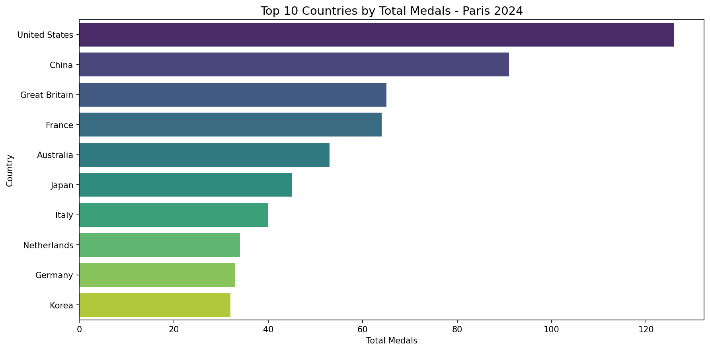
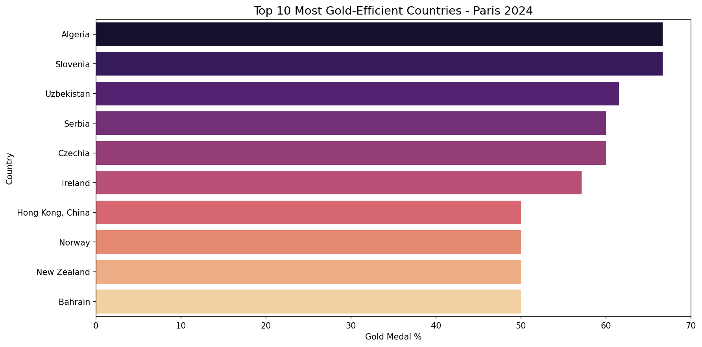
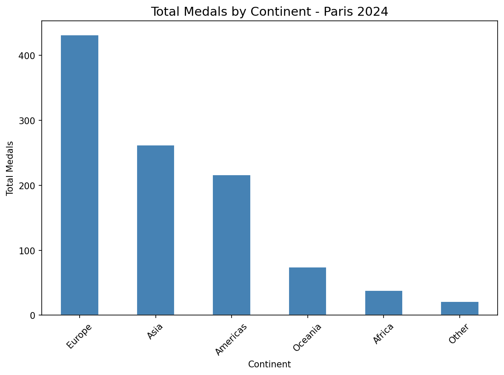
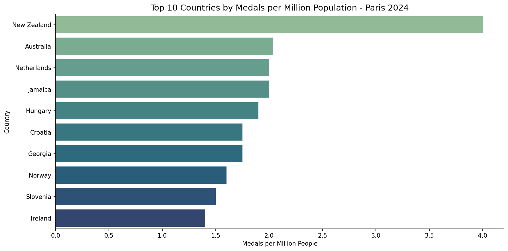

# Paris 2024 Olympics Medal Analysis
Exploratory data analysis of Paris 2024 Olympic medal distribution using Python

## Overview
This project analyzes medal distribution across countries at the Paris 2024 Olympic Games. 
Using Python and data visualization, it explores patterns in Olympic performance 
beyond simple medal counts.

## Research Questions
1. Which countries won the most medals overall?
2. Which countries were most gold-efficient?
3. How are medals distributed across continents?
4. Which countries punched above their weight relative to population?

## Dataset
- Source: [Paris 2024 Olympic Summer Games - Kaggle](https://www.kaggle.com/datasets/piterfm/paris-2024-olympic-summer-games)
- Files used: `medals_total.csv`, `nocs.csv`
- 92 countries represented

## Tools Used
- Python
- Pandas
- Matplotlib
- Seaborn
- Google Colab

## Key Findings
- The United States led the overall medal table at Paris 2024
- Algeria and Slovenia showed the highest gold efficiency, 
  with over 65% of their medals being gold
- Europe dominated continental medal distribution with over 400 total medals
- New Zealand led population-adjusted performance with 4 medals per million people,
  outperforming much larger nations significantly

## Charts

## How to Run
1. Clone this repository
2. Open `paris_olympics_analysis.ipynb` in Jupyter or Google Colab
3. Upload `medals_total.csv` and `nocs.csv` when prompted
4. Run all cells in order
